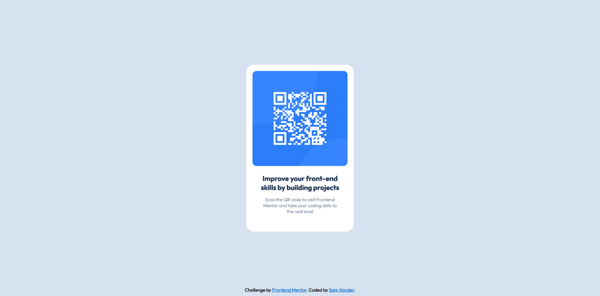

# Frontend Mentor - QR code component solution

This is a solution to the [QR code component challenge on Frontend Mentor](https://www.frontendmentor.io/challenges/qr-code-component-iux_sIO_H). Frontend Mentor challenges help you improve your coding skills by building realistic projects. 

## Table of contents

- [Overview](#overview)
  - [Screenshot](#screenshot)
  - [Links](#links)
- [My process](#my-process)
  - [Built with](#built-with)
  - [What I learned](#what-i-learned)
- [Author](#author)

## Overview

### Screenshot

### Links

- Solution URL: [View here](https://www.frontendmentor.io/solutions/responsive-qr-component-with-plain-css-KRrphlPGj5)
- Live Site URL: [View here](https://sam-xander.github.io/qr-code-component/)

## My process

### Built with

- Semantic HTML5 markup
- CSS custom properties
- Flexbox
- Mobile-first workflow

### What I learned

This was a simple challenge to practice css styling, and it was useful practicing making a component to a pre-made design and making it responsive on all screens.

## Author

- Website - [Sam Xander](https://samxander.com)
- Frontend Mentor - [@sam-xander](https://www.frontendmentor.io/profile/yourusername)